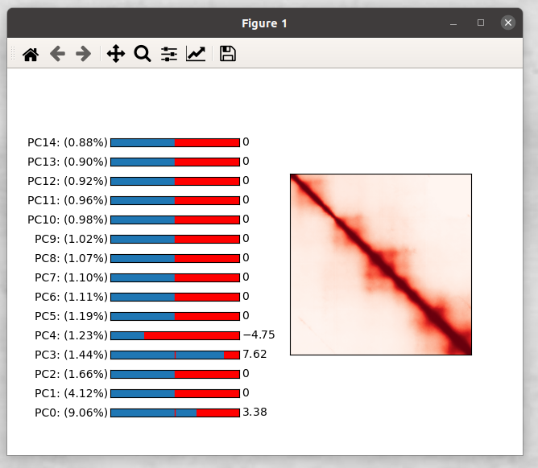

# VEHiCLE Variationally Encoded Hi-C Loss Enhancement

This directory contains code used in running experiments for the paper:

**Highsmith, M. & Cheng, J. VEHiCLE: a Variationally Encoded Hi-C Loss Enhancement algorithm. doi:10.1101/2020.12.07.413559.**

## 1. Contact:
	Max Highsmith
	Department of Computer Science
	Email mrh8x5@mail.missouri.edu

## 2. Content of Folders:
	Data:    The Raw Data, Data Loaders, and preprcoessing scripts
	Models:  Pytorch implementation of models used in experiments
	Weights: Trained weights of experiments
	Experiments: Scripts used to run experiments
	Fig_Scripts: Scripts used To generate Figures
	other_tools: tools built by other labs need to run experiments

## 3.   Hi-C Data used in this study:
	In our study we used Hi-C data from GSE63525.  Datasets are programatically downloaded and formatted via the dataloader objects (Data/<cell_line>_DataModule.py) but can be found in their raw format at
	*https://www.ncbi.nlm.nih.gov/geo/query/acc.cgi?acc=GSE63525*.

## 3. Usage
	
To view the interactive tunable Hi-C Contact matrix generating GUI run
> python Generative_GUI.py

To enhance your own HiC data run
> Enhance_Your_Oen_Data.py
You will need to edit the configuration variables:

YOUR_CELL_LINE : "name of Cell line"
LOW_RES_HIC    : "location of hic data"
CHRO	       : "chromosome number to be inspected"

This will extract Low Res HiC Contact Matrices in
	"<Your_Line>/Full_Mats"
and will place an enhanced matrix in
	"<Your_Line>/Full_Enhanced"

To obtain the Insulation Score Identified TAD boundaries run
> python Insulation.py <enhanced cell_line> <chromosome> <coordinate file> <resolution> <tadfn>

example
> python Insulation.py GM12878/Full_Enhanced/full_enh.npy 7 GM12878/Full_Mats_Coords/coords_chr7_res_10000.npy 10000 enh.txt

## 4. Reproducibility

Because of their size we store our models on our lab server.
The trained models used in experiments can be found at
http://sysbio.rnet.missouri.edu/3dgenome/VEHiCLE_Weights/
